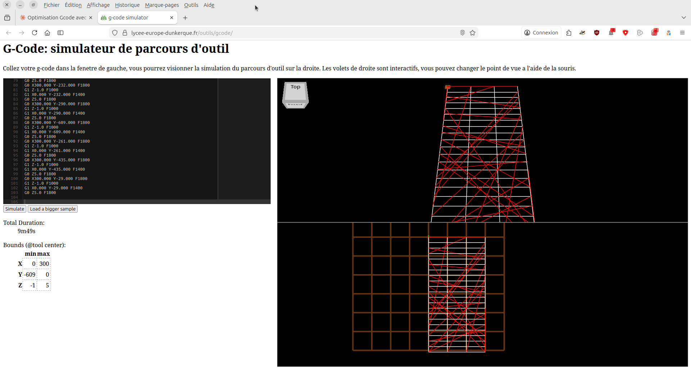

# G-Code Optimizer

A Python tool to optimize G-code toolpaths by minimizing rapid travel movements.

## 📋 Description

This program analyzes a G-code file and reorganizes cutting segments to minimize rapid travel (G0) movements between operations. The optimization uses a nearest neighbor algorithm to determine the optimal sequence of segments.

**Key Features:**
- ✅ Automatic optimization of all layers (negative Z values)
- ✅ Multi-layer support with automatic detection
- ✅ Segment reversal option for even better optimization
- ✅ Continuous segment detection to avoid unnecessary Z movements
- ✅ Centralized configuration of parameters (speeds, heights)
- ✅ Protection against accidental file overwriting

## 🚀 Installation

No external dependencies required, just Python 3.6+

```bash
git clone https://github.com/your-username/gcode-optimizer.git
cd gcode-optimizer
```

## 💻 Usage

### Basic Syntax

```bash
python optimized.py <input_file.gcode> [options]
```

### Available Options

| Option | Shortcut | Description |
|--------|----------|-------------|
| `--layer <Z>` | - | Optimize only the layer at specified Z height |
| `--allow-reverse` | `-r` | Allow segment reversal for better optimization |
| `--allow-comments` | `-c` | Include detailed comments in output G-code |
| `--force` | `-f` | Overwrite output file without confirmation |
| `--verbose` | `-v` | Display detailed debug information |

### Examples

```bash
# Simple optimization of all layers
python optimized.py decoupe.gcode

# Optimization with segment reversal (best results)
python optimized.py decoupe.gcode -r

# Optimize single layer only
python optimized.py decoupe.gcode --layer -1.0

# Optimization with comments for inspection
python optimized.py decoupe.gcode -r -c

# Force overwrite without confirmation
python optimized.py decoupe.gcode -f
```

## ⚙️ Configuration

Parameters can be modified directly at the beginning of `optimized.py`:

```python
SAFE_Z = 5.0              # Safe height for Z movements
RAPID_FEEDRATE = 1500.0   # Feedrate for rapid G0 moves
PLUNGE_FEEDRATE = 300.0   # Feedrate for Z plunge moves
DEFAULT_FEEDRATE = 500.0  # Default feedrate if not specified in G-code
```

## 📊 Optimization Results

The program displays detailed statistics for each layer:

```
Layer 1/1: Z = -1.0
============================================================
  Movements found: 245, at target Z: 245
✓ Found 245 segments
  Cutting: 8736.00mm
  Rapid travel: 8957.62mm → 784.12mm (saved 91.2%)
  Total distance: 17693.62mm → 9520.12mm (saved 46.2%)
```

### Example Results

The repository contains example files showing the optimization:

| File | Description | Result |
|------|-------------|--------|
| `decoupe.gcode` | Original unoptimized file | - |
| `decoupe-optimized1.gcode` | Simple optimization | ~9% savings on total distance |
| `decoupe-optimized2.gcode` | Optimization with `-r` | ~46% savings on total distance |

### Visualizations

Toolpath simulations clearly show the improvement:

| Original | Optimized (simple) | Optimized (-r) |
|----------|-------------------|----------------|
|  |  |  |

## 🔧 How It Works

1. **Layer Detection**: The program analyzes the G-code and detects all negative Z heights (cutting operations)

2. **Segment Extraction**: For each layer, it extracts all cutting segments (X/Y movements at constant Z)

3. **Optimization**: Uses the nearest neighbor algorithm to reorder segments and minimize travel between them

4. **Reversal Option** (`-r`): Allows reversing the cutting direction of a segment if it reduces travel to the next segment

5. **Continuity Detection**: Identifies consecutive segments to avoid unnecessary Z lift/plunge movements

6. **Optimized G-code Generation**: Produces a new file with reordered segments

## 📝 Output Format

The generated file has the `-optimized` suffix:
- `input.gcode` → `input-optimized.gcode`

Generated G-code structure:
```gcode
G21                    ; Metric mode
G90                    ; Absolute positioning
G0 Z5.0 F1500.0       ; Lift to safe height

; For each segment:
G0 X... Y... F1500.0  ; Rapid move to segment start
G1 Z-1.0 F300.0       ; Controlled plunge
G1 X... Y... F500.0   ; Cutting move
G0 Z5.0 F1500.0       ; Lift to safe height

M30                    ; End program
```

## 🎯 Use Cases

- **CNC Cutting**: Optimization of laser, plasma, waterjet cutting paths
- **Engraving**: Reducing engraving time on CNC machines
- **PCB**: Optimizing PCB milling operations
- **Any 2.5D G-code**: Any operation with multiple passes at constant Z

## ⚠️ Limitations

- Works only with 2.5D operations (layers at constant Z)
- Only optimizes Z heights ≤ 0 (positive Z values are considered safe heights)
- Does not modify continuous 3D operations (XYZ interpolation)
- Segments must be straight lines (G0/G1)

## 🤝 Contributing

Contributions are welcome! Feel free to open an issue or pull request.

## 📄 License

This project is licensed under the MIT License - see the LICENSE file for details.

## 🙏 Acknowledgments

Developed to optimize production time on CNC machines and reduce tool wear.
